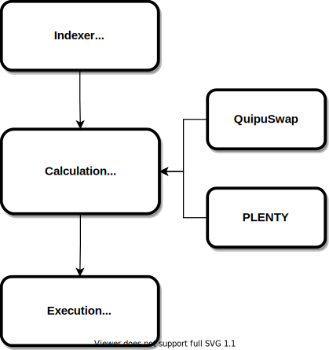

# Architecture

**arbuinoz** contains from the several components that can be extended and modified to use for your own purposes

* [Indexer](./indexer.md)
* [Calculations](./calculations.md)
* [Execution](./execution.md)

You can read in more details about each of the components in the corresponding section of the tutorial.

## Architecture diagram

Architecture diagram above show the relationship between components mantined above and illustrates the process flow.

An [indexer](./indexer.md) component is responsible for listening change of the storage in corresponding DEX contract that is written to the blockchain. 
In case of change occures it sends the updated storage value to the component that is responsible for [calculation](./calculations.md) of the possible arbitrage opportunities.
After succesfull discovery of an existed opportunities [execution](./execution.md) component is responsible for creating and submitting transaction into the blockchain.

