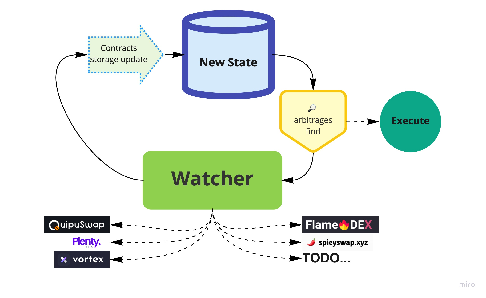

# Architecture

**arbuinos** provides several components that work together and can be extended and modified for your own purposes

* [Watcher](./watcher.md)
* [Arbitrage find](./calculations.md)
* [Execution](./execution.md)

More details on each of the components are in the corresponding section of the tutorial.

## Architecture diagram

Architecture diagram above show the relationship between components mantined above and illustrates the process flow.

- A **[watcher](./indexer.md)** component is responsible for listening change of the storage in corresponding DEX contract on blockchain. 
- In case of change occures it sends the updated storage value to the component that is responsible for **[arbitrage find](./calculations.md)**.
- After successful discovery of an existed opportunities **[execution](./execution.md)** component is responsible for creating a transaction that you cand send to blockchain.

