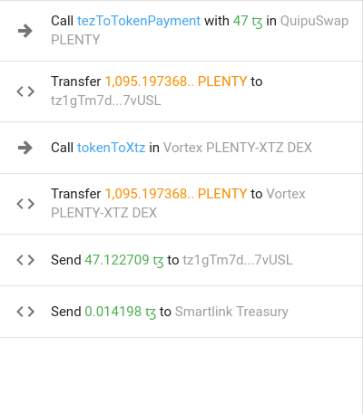

# Introduction

arbuinoz - is a set of tools and templates written in JavaScript that allows to exploit arbitrage opportunities in an automated way and build your own trading bot. In this tutorial we will walk throught the definition of an arbitrage opportunities, it's specifics in Tezos DeFi ecosystem and one of the possible solutions that you can use to exploit such opportunities.

## What is an arbitrage?

> Arbitrage is the simultaneous purchase and sale of the same asset in different markets in order to profit from tiny differences in the asset's listed price. It exploits short-lived variations in the price of identical or similar financial instruments in different markets or in different forms. 

from [investopedia.com](https://www.investopedia.com/terms/a/arbitrage.asp)

Whilst arbitrage is a common practice that is used in the traditianal markets for mizimizing it's efficiency it has it's own specifics in [DeFi aka Decentralised Finance](https://www.investopedia.com/decentralized-finance-defi-5113835). One of the integral part of the DeFi is [DEX aka Decentralised Exchange](https://www.coinbase.com/ru/learn/crypto-basics/what-is-a-dex)

AMM??

In this tutorial main focus will be on DeFi on top of the the Tezos blockchain. Which has a set of advantages over the other, such as an energy efficiency, governance process and on-chain upgrade mechanism that you can learn more on [official site](https://tezos.com)

The aim of this guide is explain how arbitrage opportunities looks like in the Tezos DeFi ecosystem and provide a toolkit and sample templates that allows users to exploit such opportunities in an automated way.

## What is an arbitrage bots?
???

## Types of arbitrages

The most basic arbitrage oportunity can appear between between two DEXes that traids the same pair. Let's have a look at the example from


https://tzkt.io/ong57qzaMAv3SocHoyVe8PSVk7VNXLJnixUyfQB6icFmLWso12V

## Table of contests

Main components of arbitrage bot. Architecture.
    - Indexer
    - Calculations
        - DEX adapters
    - Execution
        - Local runner
        - Remote runner
    - Challanges
        - Transaction front-running
        - Multy opportunity executions
        - 

# Following steps

Adding more DEXes
    - Generating all possible pars from existed tokens
Secure deployments to cloud
Improved monitoring and observability
? Bot as a service. Investors are sharing part of the profit?


<!---
# Tutorial Intro

Let's discover **Docusaurus in less than 5 minutes**.

## Getting Started

Get started by **creating a new site**.

Or **try Docusaurus immediately** with **[docusaurus.new](https://docusaurus.new)**.

### What you'll need

- [Node.js](https://nodejs.org/en/download/) version 14 or above:
  - When installing Node.js, you are recommended to check all checkboxes related to dependencies.

## Generate a new site

Generate a new Docusaurus site using the **classic template**.

The classic template will automatically be added to your project after you run the command:

```bash
npm init docusaurus@latest my-website classic
```

You can type this command into Command Prompt, Powershell, Terminal, or any other integrated terminal of your code editor.

The command also installs all necessary dependencies you need to run Docusaurus.

## Start your site

Run the development server:

```bash
cd my-website
npm run start
```

The `cd` command changes the directory you're working with. In order to work with your newly created Docusaurus site, you'll need to navigate the terminal there.

The `npm run start` command builds your website locally and serves it through a development server, ready for you to view at http://localhost:3000/.

Open `docs/intro.md` (this page) and edit some lines: the site **reloads automatically** and displays your changes.

-->

